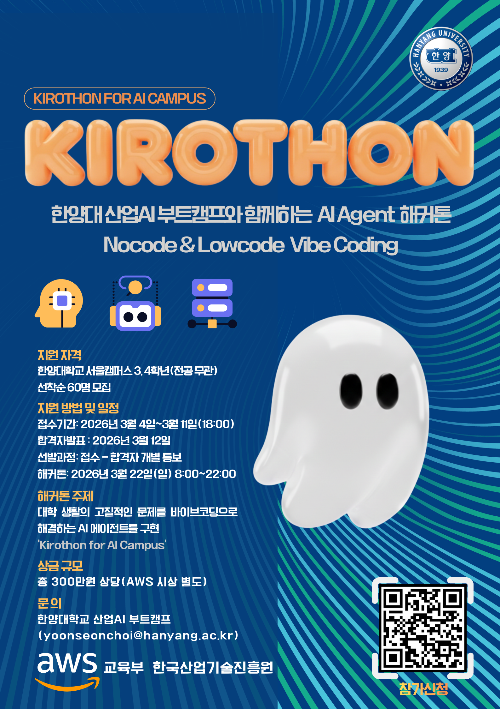
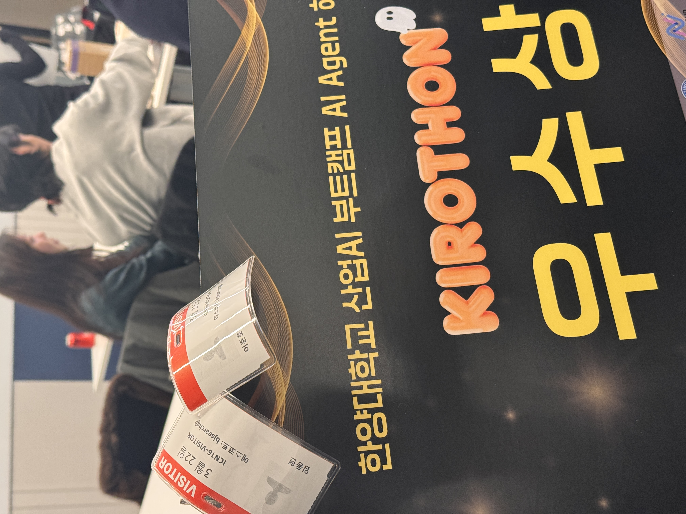

# KIROTHON Store

**대학 프로젝트의 모든 것 — 아카이빙 + AI 추천 + 팀빌딩 통합 플랫폼**

<p align="center">
  
  
</p>

대학생 해커톤/공모전/ICPBL 프로젝트를 탐색하고, AI 비서에게 맞춤 추천을 받을 수 있는 웹 플랫폼

> [!IMPORTANT]
> **KIROTHON 해커톤 — 우수상 수상**

[]()


---

## 프로젝트 개요

KIROTHON Store는 대학생들이 해커톤, ICPBL, 동아리, 공모전 등 다양한 프로젝트 활동을 탐색하고, AI 비서를 통해 프로젝트 추천, 대회 탐색, 팀빌딩, Vibe Coding 가이드를 받을 수 있도록 설계된 웹 플랫폼입니다.

현재 저장소의 코드는 `hackathon-store/` 아래의 Next.js 기반 UI 프로토타입 기준으로 정리되어 있으며, 화면 동작은 목(mock) 데이터 중심으로 구성되어 있습니다.

---

## 주요 기능

| 기능 | 설명 |
|------|------|
| **AI 채팅 추천** | 프로젝트/대회/팀빌딩/Vibe Coding 흐름에 맞춘 채팅형 추천 UI |
| **프로젝트 탐색/필터** | 프로젝트 카드 탐색, 검색, 카테고리/기술 스택 필터링 |
| **이벤트 목록** | 해커톤/공모전 목록과 상세 정보 탐색 |
| **팀원 모집** | 모집 글 탐색, 상세 보기, 작성 폼 UI |
| **Vibe Coding 가이드** | 아이디어를 단계별 구현 흐름과 프롬프트로 정리 |

---

## 현재 코드베이스 메모

- 앱 진입점은 저장소 루트가 아니라 `hackathon-store/` 입니다.
- 현재 브랜치 기준 구현은 `src/app` 구조의 Next.js App Router UI 프로토타입입니다.
- 실제 공통 레이아웃 연결은 `src/app/layout.tsx` -> `src/components/layout/AppShell.tsx` 입니다.
- 로컬 기획 문서 폴더 `docs/` 는 `.gitignore` 에 포함되어 원격에 올리지 않습니다.

---

## 기술 스택

| 분류 | 기술 |
|------|------|
| **Frontend** | Next.js 16, React 19, TypeScript, Tailwind CSS 4 |
| **UI** | Lucide React |
| **Testing** | Vitest, Testing Library, fast-check, jsdom |
| **Data** | TypeScript mock data modules |

---

## 프로젝트 구조

```text
hack_store/
├── assets/
│   ├── kiro.png                   # README 포스터 이미지
│   └── 우수상.jpeg               # README 수상 이미지
├── hackathon-store/
│   ├── next-env.d.ts
│   ├── next.config.ts
│   ├── package-lock.json
│   ├── package.json
│   ├── postcss.config.mjs
│   ├── tsconfig.json
│   └── vitest.config.ts
│
│   ├── public/
│   │   ├── posters/               # 대회 포스터 이미지
│   │   └── thumbnails/            # 프로젝트 썸네일 이미지
│
│   ├── src/
│   │   ├── app/
│   │   │   ├── layout.tsx         # RootLayout
│   │   │   ├── page.tsx           # 홈 대시보드
│   │   │   ├── chat/
│   │   │   │   └── page.tsx       # AI 채팅 페이지
│   │   │   ├── projects/
│   │   │   │   ├── page.tsx       # 프로젝트 목록/필터
│   │   │   │   └── [id]/
│   │   │   │       └── page.tsx   # 프로젝트 상세
│   │   │   ├── events/
│   │   │   │   ├── page.tsx       # 대회 목록
│   │   │   │   └── [id]/
│   │   │   │       └── page.tsx   # 대회 상세
│   │   │   ├── recruit/
│   │   │   │   └── page.tsx       # 팀원 모집
│   │   │   └── vibe-coding/
│   │   │       └── page.tsx       # Vibe Coding 가이드
│
│   │   ├── components/
│   │   │   ├── chat/              # ChatInput, ChatMessage, ChatSidebar, TypingIndicator
│   │   │   ├── events/            # EventCard
│   │   │   ├── layout/            # AppShell, Sidebar, TopBar, BottomTabBar, CommandPalette, Footer, Navbar
│   │   │   ├── projects/          # ProjectCard
│   │   │   ├── recruit/           # RecruitCard, RecruitForm
│   │   │   ├── ui/                # Badge, Button, Card, FilterChips, FilterPanel, Modal
│   │   │   └── vibe-coding/       # IdeaForm, PromptBlock, StepCard
│   │   ├── data/                  # chatResponses, events, projects, recruits, vibeCodingGuide
│   │   ├── hooks/                 # useTheme
│   │   ├── lib/                   # filters, types
│   │   ├── styles/                # globals.css
│   │   └── __tests__/
│   │       ├── setup.ts
│   │       ├── properties/        # 속성 기반 테스트
│   │       └── unit/data/         # mock data 테스트
├── docs/                          # 기획 문서 (git 제외)
├── .gitignore
└── README.md
```

---

## 실행 방법

```bash
# 의존성 설치
cd hackathon-store
npm install

# 개발 서버 실행
npm run dev
```

```bash
# 테스트
npm run test

# 빌드
npm run build

# 프로덕션 실행
npm start
```

---

## 팀원

| 이름 | 담당 | 이메일 |
|------|------|--------|
| 어준호 (Junho Uh) | Backend, Infra | djwnsgh0248@hanyang.ac.kr |
| 임동현 (Donghyun Lim) | AI Agent, Frontend | limdongxian1207@gmail.com |

---

## 라이선스

MIT License
