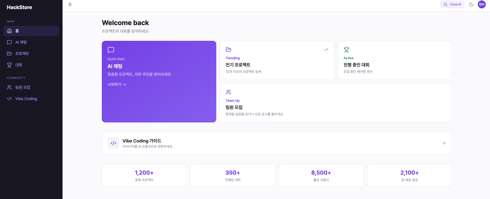

# KIROTHON Store

**대학 프로젝트의 모든 것 — 아카이빙 + AI 추천 + 팀빌딩 통합 플랫폼**

<p align="center">
  
  
</p>

대학생 해커톤/공모전/ICPBL 프로젝트를 탐색하고, AI 비서에게 맞춤 추천을 받을 수 있는 웹 플랫폼

> [!IMPORTANT]
> **KIROTHON 해커톤 — 우수상 수상**

[]()


---

## 프로젝트 개요

KIROTHON Store는 대학생들이 해커톤, ICPBL, 동아리, 공모전 등 다양한 프로젝트 활동을 탐색하고, AI 비서를 통해 프로젝트 추천, 대회 탐색, 팀빌딩, Vibe Coding 가이드를 받을 수 있도록 설계된 웹 플랫폼입니다.

현재 저장소의 코드는 `hackathon-store/` 아래의 Next.js 기반 UI 프로토타입 기준으로 정리되어 있으며, 화면 동작은 목(mock) 데이터 중심으로 구성되어 있습니다.

<p align="center">
  
</p>

---

## 주요 기능

| 기능 | 설명 |
|------|------|
| **홈 대시보드** | 핵심 기능으로 바로 진입할 수 있는 Bento 스타일 홈 화면 |
| **AI 채팅 추천** | 프로젝트 추천, 대회 탐색, 팀빌딩, Vibe Coding 흐름을 채팅 UI로 제공 |
| **프로젝트 아카이브** | 프로젝트 카드 탐색, 검색, 카테고리/기술 스택 기반 필터링 지원 |
| **이벤트 보드** | 해커톤/공모전 목록과 상세 정보 탐색 |
| **팀원 모집** | 모집 글 탐색, 상세 보기, 모집 글 작성 폼 제공 |
| **Vibe Coding 가이드** | 아이디어를 구현 단계와 프롬프트 형태로 정리 |

---

## 화면 구성

| 화면 | 설명 |
|------|------|
| **Home** | 대시보드형 메인 화면, 빠른 진입 카드, 통계 요약 |
| **Chat** | 추천 질문 칩, 메시지 흐름, 타이핑 인디케이터 포함 |
| **Projects** | 프로젝트 목록, 검색, 필터, 상세 페이지 연결 |
| **Events** | 대회 목록, 상태별 탐색, 상세 정보 확인 |
| **Recruit** | 팀원 모집 공고 목록, 상세 보기, 작성 폼 |
| **Vibe Coding** | 아이디어 입력, 단계별 가이드, 프롬프트 블록 |

---

## 기술 스택

| 분류 | 기술 |
|------|------|
| **Frontend** | Next.js 16, React 19, TypeScript, Tailwind CSS 4 |
| **UI** | Lucide React |
| **Testing** | Vitest, Testing Library, fast-check, jsdom |
| **Data** | TypeScript mock data modules |

---

## 실행 방법

```bash
# 의존성 설치
cd hackathon-store
npm install

# 개발 서버 실행
npm run dev
```

```bash
# 테스트
npm run test

# 빌드
npm run build

# 프로덕션 실행
npm start
```

---

## 팀원

| 이름 | 담당 | 이메일 |
|------|------|--------|
| 어준호 (Junho Uh) | Backend, Infra | djwnsgh0248@hanyang.ac.kr |
| 임동현 (Donghyun Lim) | AI Agent, Frontend | limdongxian1207@gmail.com |

---

## 라이선스

MIT License
